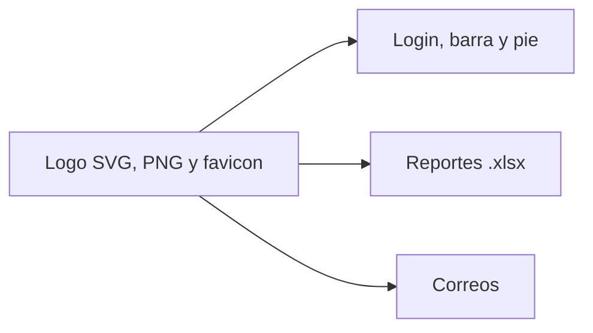

# Marca y reportes

El SVG se usa en la barra y el pie. El PNG, con el emblema y el nombre completos, va en el carrusel de acceso, en el banner del Excel y como imagen incrustada en el correo. El favicon sale del emblema de ese PNG.
