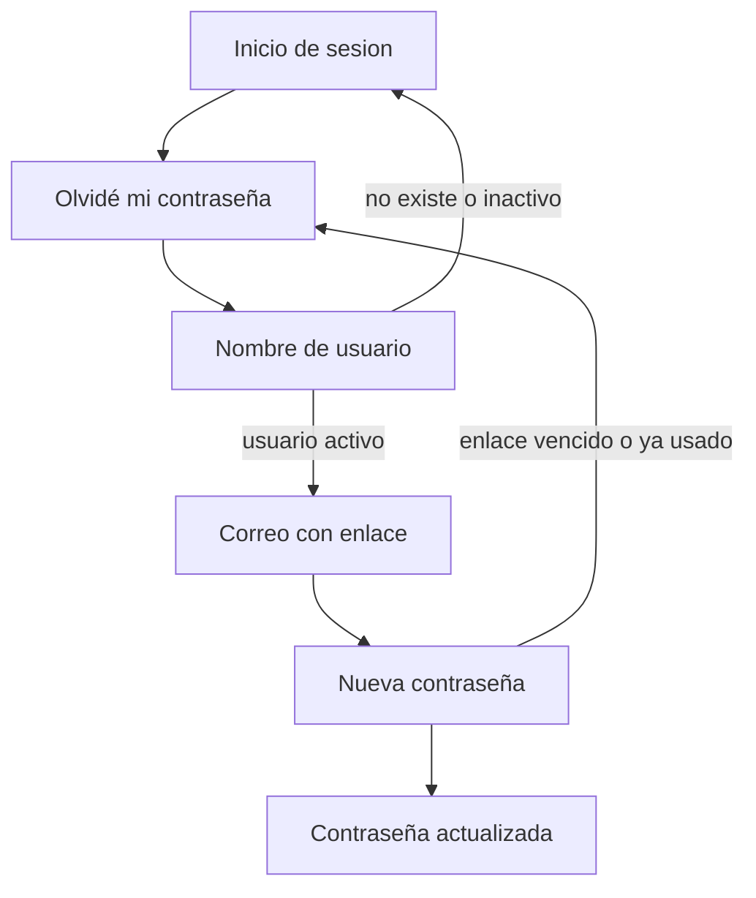

# Restablecer la contraseña

La persona escribe su usuario. Si existe y está activa, el correo registrado recibe un enlace de un solo uso. El enlace vence a los 5 minutos. La respuesta en pantalla no dice si el usuario existe.

El enlace del correo apunta a la dirección pública de la aplicación (`http://131.196.8.22:3110`), igual que el resto de hipervínculos de los avisos. No usa el host de quien pidió el cambio.

Al borrar una tarea o una programación, el sistema envía un correo a quien la tenía asignada y a quien la creó, salvo a la persona que acaba de borrarla. El aviso en pantalla sigue apareciendo para quien hizo la acción.
