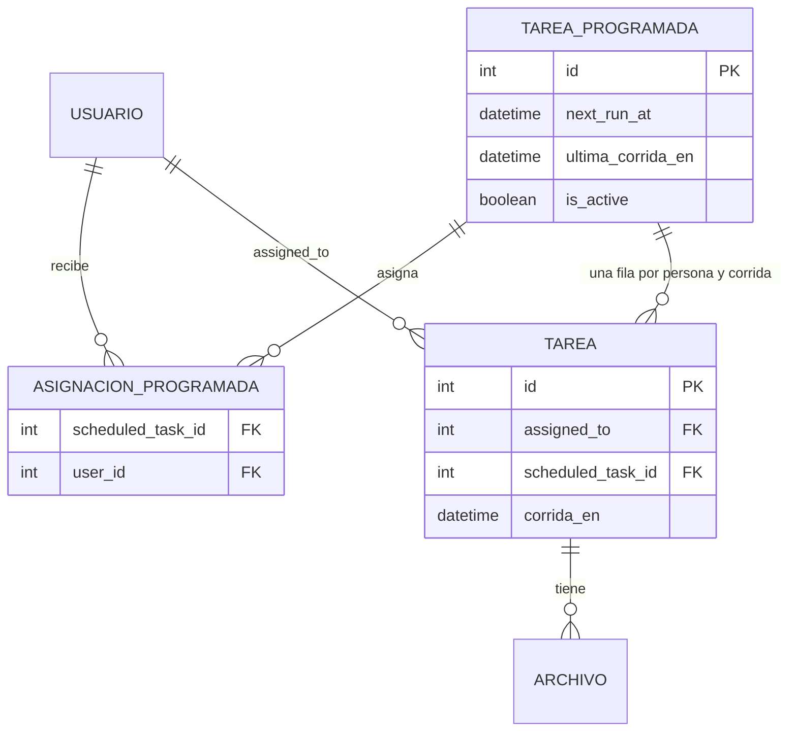
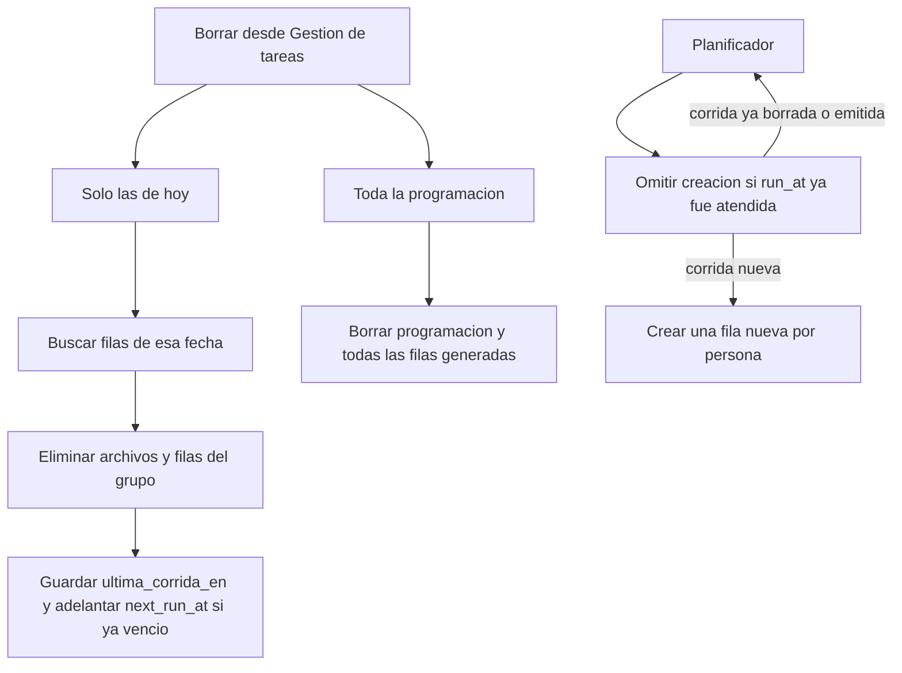

# Tareas programadas y borrado

La fecha de fin no puede ser anterior a la de inicio. El formulario y el servidor rechazan esa combinación.

La hora de la programación es la de Ecuador (UTC−5, sin horario de verano). Medianoche es medianoche en la finca. El planificador no usa la hora UTC del servidor para decidir si ya toca crear la corrida.

Una programacion asignada a varias personas genera una fila de `tasks` por persona. Esas filas comparten `scheduled_task_id` y `corrida_en`. Borrar una copia retira toda la generacion y marca la corrida como atendida, para que el planificador no la vuelva a insertar.

En la ficha del área, esas filas no se listan una por una. Cada programación ocupa una sola fila y las corridas se abren dentro de ella.

El listado de administración filtra en el navegador. Cada tabla (periódicas y normales) tiene listas desplegables de nombre, duración y usuario. La duración de una periódica es su ciclo; la de una normal es el plazo según la fecha límite. La consulta no vuelve al servidor.

Varias filas se marcan con la casilla, un clic o arrastrando el mouse. Borrar las marcadas en la lista normal elimina solo esas tareas. Borrar las marcadas en la lista periódica elimina cada programación completa y su historial. El botón Borrar de una fila periódica sigue ofreciendo solo las de hoy o toda la programación. Después del borrado, quien tenía la tarea asignada y quien la creó reciben un correo. Quien ejecutó el borrado ve el aviso en pantalla.
